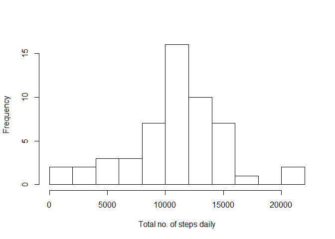
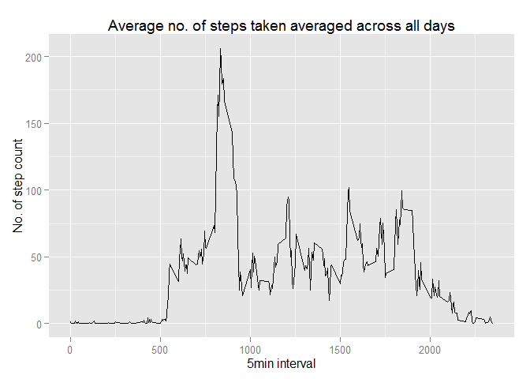
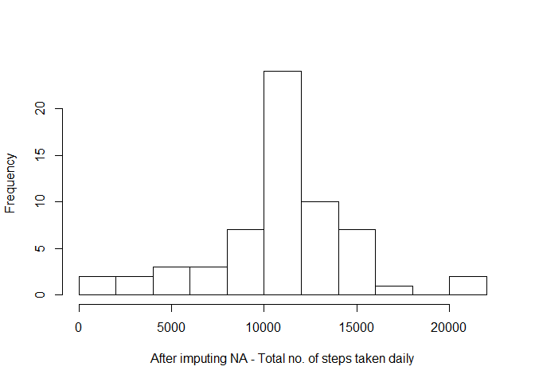
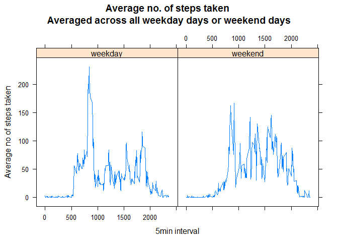

# Reproducible Research: Peer Assessment 1


## Introduction
It is now possible to collect a large amount of data about personal movement using activity monitoring devices such as a Fitbit, Nike Fuelband, or Jawbone Up. These type of devices are part of the "quantified self" movement - a group of enthusiasts who take measurements about themselves regularly to improve their health, to find patterns in their behavior, or because they are tech geeks. But these data remain under-utilized both because the raw data are hard to obtain and there is a lack of statistical methods and software for processing and interpreting the data.

This assignment makes use of data from a personal activity monitoring device. This device collects data at 5 minute intervals through out the day. The data consists of two months of data from an anonymous individual collected during the months of October and November, 2012 and include the number of steps taken in 5 minute intervals each day.


## Data
The data for this assignment can be downloaded from the course web site:

- Dataset: Activity monitoring data [52K]

The variables included in this dataset are:

- steps: Number of steps taking in a 5-minute interval (missing values are coded as NA)

- date: The date on which the measurement was taken in YYYY-MM-DD format

- interval: Identifier for the 5-minute interval in which measurement was taken

The dataset is stored in a comma-separated-value (CSV) file and there are a total of 17,568 observations in this dataset.


## Loading and preprocessing the data


```r
data <- read.table(unz("activity.zip", "activity.csv"), header=T, quote="\"", sep=",")

# convert date to Date type
data$date <- as.Date(data$date) 
```


## What is mean total number of steps taken per day?
Ignoring the missing values in the dataset:

1. Calculate the total number of steps taken per day


```r
data.ignore.na <- na.omit(data) 

# sum up steps by their date
daily.steps <- rowsum(data.ignore.na$steps, format(data.ignore.na$date, '%Y-%m-%d')) 
daily.steps <- data.frame(daily.steps) 
names(daily.steps) <- ("steps")

daily.steps
```

```
##            steps
## 2012-10-02   126
## 2012-10-03 11352
## 2012-10-04 12116
## 2012-10-05 13294
## 2012-10-06 15420
## 2012-10-07 11015
## 2012-10-09 12811
## 2012-10-10  9900
## 2012-10-11 10304
## 2012-10-12 17382
## 2012-10-13 12426
## 2012-10-14 15098
## 2012-10-15 10139
## 2012-10-16 15084
## 2012-10-17 13452
## 2012-10-18 10056
## 2012-10-19 11829
## 2012-10-20 10395
## 2012-10-21  8821
## 2012-10-22 13460
## 2012-10-23  8918
## 2012-10-24  8355
## 2012-10-25  2492
## 2012-10-26  6778
## 2012-10-27 10119
## 2012-10-28 11458
## 2012-10-29  5018
## 2012-10-30  9819
## 2012-10-31 15414
## 2012-11-02 10600
## 2012-11-03 10571
## 2012-11-05 10439
## 2012-11-06  8334
## 2012-11-07 12883
## 2012-11-08  3219
## 2012-11-11 12608
## 2012-11-12 10765
## 2012-11-13  7336
## 2012-11-15    41
## 2012-11-16  5441
## 2012-11-17 14339
## 2012-11-18 15110
## 2012-11-19  8841
## 2012-11-20  4472
## 2012-11-21 12787
## 2012-11-22 20427
## 2012-11-23 21194
## 2012-11-24 14478
## 2012-11-25 11834
## 2012-11-26 11162
## 2012-11-27 13646
## 2012-11-28 10183
## 2012-11-29  7047
```

2. Make a histogram of the total number of steps taken each day


```r
hist(daily.steps$steps, main=" ", breaks=10, xlab="Total no. of steps daily")
```

 

3. Calculate and report the mean and median of the total number of steps taken per day


```r
mean(daily.steps$steps);
```

```
## [1] 10766.19
```

```r
median(daily.steps$steps) 
```

```
## [1] 10765
```


## What is the average daily activity pattern?
1. Make a time series plot (i.e. type = "l") of the 5-minute interval (x-axis) and the average number of steps taken, averaged across all days (y-axis)


```r
library(plyr)
# Calculate average steps for each of 5-minute interval during a 24-hour period
interval.mean.steps <- ddply(data.ignore.na,~interval, summarise, mean=mean(steps))

library(ggplot2)
```

```
## Warning: package 'ggplot2' was built under R version 3.1.3
```

```r
qplot(x=interval, y=mean, data = interval.mean.steps,  geom = "line", xlab="5min interval", ylab="No. of step count", main="Average no. of steps taken averaged across all days")
```

 

2. Which 5-minute interval, on average across all the days in the dataset, contains the maximum number of steps?


```r
interval.mean.steps[which.max(interval.mean.steps$mean), ]
```

```
##     interval     mean
## 104      835 206.1698
```


## Imputing missing values
Note that there are a number of days/intervals where there are missing values (coded as NA). The presence of missing days may introduce bias into some calculations or summaries of the data.

1. Calculate and report the total number of missing values in the dataset (i.e. the total number of rows with NAs)


```r
library(sqldf)
```

```
## Loading required package: gsubfn
## Loading required package: proto
## Loading required package: RSQLite
## Loading required package: DBI
```

```r
tNA <- sqldf(' SELECT d.* FROM "data" as d WHERE d.steps IS NULL ORDER BY d.date, d.interval ')
```

```
## Loading required package: tcltk
```

```r
NROW(tNA) 
```

```
## [1] 2304
```

2. Devise a strategy for filling in all of the missing values in the dataset. The strategy does not need to be sophisticated. For example, you could use the mean/median for that day, or the mean for that 5-minute interval, etc.


```r
t1 <- sqldf('SELECT d.*, i.mean FROM "interval.mean.steps" as i JOIN "data" as d ON d.interval = i.interval ORDER BY d.date, d.interval ') 

t1$steps[is.na(t1$steps)] <- t1$mean[is.na(t1$steps)]
```

3. Create a new dataset that is equal to the original dataset but with the missing data filled in.


```r
t1.total.steps <- as.integer( sqldf('SELECT sum(steps) FROM t1') );

t1.total.steps.by.date <- sqldf('SELECT date, sum(steps) as "total_steps" FROM t1 GROUP BY date ORDER BY date');

daily.steps <- sqldf('SELECT date, total_steps as "steps" FROM "t1.total.steps.by.date" ORDER BY date');
```

4. Make a histogram of the total number of steps taken each day and Calculate and report the mean and median total number of steps taken per day. Do these values differ from the estimates from the first part of the assignment? What is the impact of imputing missing data on the estimates of the total daily number of steps?


```r
hist(daily.steps$steps, main=" ", breaks=10, xlab="After imputing NA - Total no. of steps taken daily")
```

 

```r
t1.mean.steps.per.day <- as.integer(t1.total.steps / NROW(t1.total.steps.by.date) )
t1.mean.steps.per.day
```

```
## [1] 10766
```

```r
t1.median.steps.per.day <- median(t1.total.steps.by.date$total_steps)
t1.median.steps.per.day
```

```
## [1] 10766.19
```

- These values do not differ much from estimates from the first part of the assignment.

- The impact of imputing missing data? Shape of histogram remains unchanged compared to the one with removed missing values. However, frequency counts increased as expected. In this case, it seems that the data imputation strategy should work for the downstream data analysis and modeling.


## Are there differences in activity patterns between weekdays and weekends?

1. Create a new factor variable in the dataset with two levels - "weekday" and "weekend" indicating whether a given date is a weekday or weekend day.


```r
t1$weektime <- as.factor(ifelse(weekdays(t1$date) %in% c("Saturday","Sunday"),"weekend", "weekday"))

t5 <- sqldf('SELECT interval, avg(steps) as "mean.steps", weektime FROM t1 GROUP BY weektime, interval ORDER BY interval ')
```

2. Make a panel plot containing a time series plot (i.e. type = "l") of the 5-minute interval (x-axis) and the average number of steps taken, averaged across all weekday days or weekend days (y-axis). See the README file in the GitHub repository to see an example of what this plot should look like using simulated data.


```r
library("lattice")
p <- xyplot(mean.steps ~ interval | factor(weektime), data=t5, type = 'l', main="Average no. of steps taken \nAveraged across all weekday days or weekend days", xlab="5min interval", ylab="Average no of steps taken")
print (p)    
```

 
